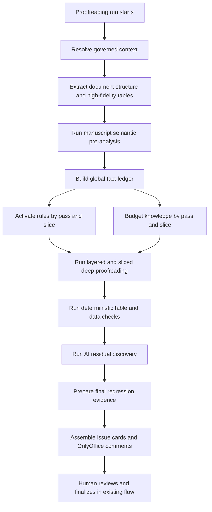

# Deep Proofreading Orchestrator Design

## Scope

This design upgrades only the proofreading module. It does not redesign screening, editing, rule authoring, knowledge authoring, or the existing OnlyOffice human-final workflow.

The new deep proofreading path becomes the default proofreading execution path. The legacy proofreading path remains available behind an internal fallback switch.

## Goals

- Support large rule and knowledge libraries without loading all rules or all knowledge into every model call.
- Improve medical manuscript proofreading quality through pass-specific and slice-specific execution.
- Strengthen table and data checking with deterministic evidence before AI interpretation.
- Keep all output as candidate issue cards and OnlyOffice comments; do not auto-edit DOCX, do not block human finalization.
- Make the global fact ledger visible as read-only evidence for operators.
- Preserve the existing OnlyOffice draft review and `human_final_docx` publication flow.

## Non-Goals

- No automatic accepted/rejected tracked changes in the first version.
- No hard blocking of final publication based on detected issues in the first version.
- No editable fact ledger in the first version.
- No changes to screening or editing execution in this design.
- No full replacement of existing rule center or knowledge library authoring flows.

## User Decisions

- Coverage: proofreading module only.
- Output boundary: candidate issue cards and OnlyOffice comments.
- Table/data scope: full medical data checking, including basic, statistical, and advanced medical-statistical checks.
- Issue handling: all findings are suggestions only.
- Runtime behavior: new path defaults on, with internal fallback.
- Quality posture: quality first, while still enforcing budgets to avoid waste.
- Fact ledger UI: visible but read-only.
- OnlyOffice mode: comments/problem cards first, no automatic tracked-change writeback.

## Architecture

Add a `DeepProofreadingOrchestrator` inside the proofreading module. It owns the new internal execution pipeline after governed context resolution and before issue cards and OnlyOffice comments are produced.

The orchestrator must reuse existing governed context, prompt templates, rule resolution, knowledge repositories, document preview, OnlyOffice, and human-final publication services where possible.

## Core Components

### DeepProofreadingOrchestrator

Coordinates the full new proofreading path:

1. Resolve existing proofreading governed context.
2. Build document structure and table snapshots.
3. Run semantic pre-analysis.
4. Build the global fact ledger.
5. Activate pass/slice rules.
6. Apply knowledge budgets.
7. Run deep proofreading passes.
8. Run deterministic table/data checks.
9. Merge issues and build comments.
10. Persist pass summaries, fact ledger, budget statistics, and issue cards.

It must expose an internal fallback path to the legacy proofreading execution if orchestration fails before issue output can be safely produced.

### DocumentSemanticPreAnalyzer

Annotates source blocks and extracted document objects. It should identify:

- Structural sections: title, abstract, keywords, body sections, references, tables, figures, footnotes.
- Semantic roles: objective, methods, results, conclusion, sample size, grouping, outcome indicators, statistical expressions, medical terms.
- Risk-bearing entities: numbers, percentages, P values, confidence intervals, units, abbreviations, table/figure references.

This analyzer may combine deterministic parsing and AI-assisted classification. Low-confidence classifications must be retained with confidence scores rather than silently discarded.

### GlobalFactLedger

Creates a shared, read-only fact layer used by every pass and slice.

Fact groups:

- Manuscript facts: study type, study population, time range, sample size, groups.
- Medical facts: disease, operation, intervention, outcome indicators, diagnostic metrics.
- Statistical facts: methods, P values, confidence intervals, OR/HR/RR, mean±SD, units.
- Table facts: table number, title, header paths, cell facts, footnotes, units, references from body text.
- Terminology facts: abbreviations, English expansions, Chinese terms, synonyms.
- Conflict facts: same object with inconsistent values across locations.

The fact ledger is visible in the proofreading result page as read-only evidence. It must show source location, confidence, and conflict status. It is not editable in the first version.

### RuleActivationService

Reduces rule volume before model calls and pass execution.

Activation dimensions:

- `passKind`: medical facts, structure/logic consistency, data/statistics/tables, language/format, residual synthesis, final regression preparation.
- Slice type: section, block kind, table, figure, reference, statistical expression.
- Rule object: table, statistical expression, title, reference, medical term, formatting, content.
- Risk level and priority.
- Template, journal template, general package, and medical package context already resolved by existing governance.

Rules that cannot be confidently classified must be placed in a conservative fallback pool. They should not be loaded into every pass by default unless their priority or scope requires it.

### KnowledgeBudgetService

Controls knowledge volume per pass and slice.

Budget rules:

- Enforce per-pass and per-slice limits for item count and token estimate.
- Deduplicate explicit binding knowledge and dynamic knowledge.
- Rank knowledge by relevance and authority.
- Priority order: journal template, medical package, general package, template family, dynamic recall.
- Only pass/slice-relevant `prompt_snippet` knowledge is inserted into prompts.
- Evidence-style knowledge remains citeable by ID and summary; full text is not blindly inserted.

The first version includes metadata filtering, keyword recall, vector recall, and lightweight model reranking. Model reranking must operate only on a narrow candidate set after deterministic filters, keyword/vector recall, deduplication, and budget pre-trimming.

### RuleKnowledgeRetrievalService

Builds the candidate set used by rule activation and knowledge budgeting.

Retrieval stages:

1. Deterministic scope filtering by template, journal template, manuscript type, medical package, general package, rule status, and knowledge status.
2. Keyword and metadata recall from section names, statistical terms, table headers, medical terms, abbreviations, and manuscript semantic tags.
3. Vector recall over rule summaries, rule semantic descriptors, knowledge summaries, and `prompt_snippet` fields.
4. Lightweight model reranking over a narrow candidate set only.
5. Final budget trimming by pass, slice, authority, risk, and token estimate.

The service must return evidence for why each item was selected: binding match, keyword hit, vector similarity, model rerank reason, priority, and budget decision. If vector recall or reranking fails, the orchestrator must fall back to deterministic scope filtering plus keyword recall.

### DeepProofreadingPassRunner

Runs focused passes with pass-specific prompts, activated rules, knowledge budgets, and fact ledger summaries.

Pass order:

1. Document structure and high-fidelity extraction.
2. Semantic pre-analysis.
3. Global fact ledger generation.
4. Medical facts and terminology.
5. Structure, logic, and context consistency.
6. Data, statistics, units, and tables.
7. Language, style, punctuation, and journal format.
8. Residual discovery.
9. Final regression preparation.
10. Issue card and OnlyOffice comment assembly.

### TableDataDeterministicChecker

Runs deterministic table and data checks before or alongside AI interpretation.

Scope:

- Basic checks: numbers, percentages, P values, units, ± expressions, figure/table numbering, text-table references.
- Statistical checks: sample sizes, groups, mean±SD, rates/proportions, P-value direction, test-statistic consistency.
- Advanced medical-statistical checks: diagnostic metrics, AUC/CI, regression coefficients, OR/HR/RR, confidence intervals, unit magnitude anomalies.

All findings are suggestions only. No automatic edit, no publication block.

### ProofreadingIssueCardAssembler

Merges outputs from deterministic checks, governed rules, quality packages, AI passes, and residual discovery.

It produces issue cards and OnlyOffice comment anchors.

## Table and Data Fidelity Requirements

The extractor must preserve both display fidelity and normalized analysis text.

For every table cell, store at least:

- `rawXmlText`: source-derived raw text when available.
- `displayText`: user-visible text, preserving spacing such as `12.3  ±  1.4`.
- `normalizedText`: analysis text, such as `12.3±1.4`.
- Row and column coordinates.
- Merged cell information.
- Header path.
- Footnote anchors and footnote content.
- Unit markers.
- Border/style signals where available.
- Character-level `styleRuns`.

`styleRuns` must preserve:

- Italic, bold, underline.
- Superscript and subscript.
- Font family, font size, color where available.
- Character spans or run spans.

This is required for medical and statistical notation such as italic `P`, `t`, `F`, `r`, `χ²`, `OR`, `HR`, `CI`, superscripts, subscripts, and formulas.

Confidence levels:

- High: standard DOCX table, clear coordinates, clear text and units.
- Medium: complex merge, style-rich statistical notation, cross-table references, special symbols.
- Low: image table, OCR-derived table, manually drawn table, formula-heavy or abnormal structure.

Low-confidence table data may produce a review suggestion but must not produce a deterministic contradiction claim.

## Slice Strategy

Do not slice by paragraph or token count alone. Build task slices from document structure and proofreading intent.

Slice types:

- Table slice: table, title, notes, footnotes, units, and body references to the table.
- Data slice: sentences with numbers/statistics plus linked tables and figure captions.
- Consistency slice: related facts across abstract, objective, methods, results, and conclusion.
- Language/format slice: title, authors, affiliations, abstract, keywords, references, captions, numbering.
- Medical fact slice: disease, operation, intervention, diagnosis, contraindication, outcome terms.
- Residual slice: uncovered or low-confidence areas after prior passes.

Every slice receives:

- A compact fact ledger summary.
- Neighbor context where relevant.
- Activated rules for that slice.
- Budgeted knowledge for that slice.
- Pass-specific instructions.

## Issue Deduplication Policy

Issue deduplication must use evidence and source strength, not only string keys.

Main-card source priority:

1. Deterministic checks.
2. Governed rule hits.
3. Quality package or medical package findings.
4. AI pass findings.
5. Residual synthesis findings.

Tie breakers:

- Higher risk wins over lower risk.
- More precise location wins over less precise location.
- Higher confidence wins over lower confidence.
- Earlier governed source order wins only after stronger evidence dimensions tie.

Deduplication keys:

- Strong duplicate: same location, same excerpt, same issue type.
- Weak duplicate: same fact object, such as the same sample size, same table cell, same P value, or same group name.
- Semantic duplicate: different wording pointing to the same underlying error.

Merge strategy:

- Keep one main issue card.
- Attach duplicate sources to `supportingEvidence`.
- If suggestions conflict, set `conflicting_suggestions` and require human judgment.
- Residual synthesis may add new issues but must not override deterministic, governed rule, or quality package findings.

## Issue Card Contract

Each issue card should include:

- Issue ID.
- Title.
- Severity/risk level.
- Issue type and category.
- Source layer: deterministic, governed rule, quality package, AI pass, residual.
- Pass kind and slice ID.
- Location anchor: block, section, table, cell, figure, reference, or multi-location evidence.
- Original excerpt.
- Suggested change or suggested review action.
- Rationale.
- Related rule IDs.
- Related knowledge item IDs.
- Related fact ledger IDs.
- Confidence.
- Supporting evidence.
- Conflict flags.

## OnlyOffice Integration

The first version uses comments/problem cards only.

- Generate a comment for each issue card when a stable anchor is available.
- Prefer cell-level anchors for table issues.
- Use table-level or title-level anchors if cell-level anchors are unavailable.
- Use sentence/block anchors for text and data issues.
- Use multi-location evidence in the issue card for context consistency issues.
- Do not create automatic tracked changes in the first version.
- Do not block human final publication.
- Preserve the existing `human_final_docx` flow.

Human decisions from OnlyOffice review and final publication should feed residual learning and future rule/knowledge candidates.

## Defaulting and Fallback

The new orchestrator is the default proofreading path.

An internal fallback switch must allow the system to return to the legacy proofreading path without changing user-facing workflow.

Fallback points:

- Orchestrator failure before issue output: use legacy path.
- Rule activation failure: use existing module-level rules.
- Knowledge budget failure: use current governed knowledge hits.
- Slice execution failure: use pass-level full document execution.
- Table extraction low confidence: produce review suggestions only.

Every fallback must be logged with reason and surfaced in pass execution diagnostics.

## Observability

Persist or expose diagnostics for:

- Pass run status and duration.
- Slice count and slice types.
- Activated rule count by pass and slice.
- Knowledge item count and token estimate by pass and slice.
- Fact ledger item count and conflict count.
- Table extraction confidence and unsupported table structures.
- AI model calls, token estimates, and cost estimates where available.
- Issue counts by source, severity, pass, and deduplication status.
- Fallback reason and fallback scope.

## UI Changes

Proofreading result page adds:

- Deep proofreading overview.
- Issue card list.
- Read-only fact ledger tab.
- Pass execution summary.
- Cost, duration, rule-hit, and knowledge-hit summary.

OnlyOffice entry remains the existing review flow. The UI should not require users to manually select rules or knowledge per slice.

## Validation Plan

Use real medical manuscripts and curated examples.

Acceptance checks:

- New proofreading path runs by default.
- Internal fallback can restore legacy execution.
- Issue cards and OnlyOffice comments are generated.
- No automatic tracked changes are produced.
- No detected issue blocks human finalization.
- Read-only fact ledger is visible.
- Table extraction stores `rawXmlText`, `displayText`, `normalizedText`, and `styleRuns`.
- Italic statistical symbols, superscripts, subscripts, and ± spacing are preserved when source data supports it.
- Table/data deterministic checks produce evidence-linked issue cards.
- Rule and knowledge counts are bounded per pass/slice.
- Pass summaries exist for all deep proofreading passes.
- Deduplication retains higher-evidence main cards and supporting evidence.

Quality metrics:

- Lower duplicate issue rate.
- Higher table/data issue localization accuracy.
- Higher human acceptance rate.
- Lower high-risk miss rate on curated manuscripts.
- Explainable cost and duration per manuscript.
- Traceable rule, knowledge, and fact evidence per issue.

## Risks

- Complex DOCX table structures may not support full high-fidelity extraction.
- Slice classification mistakes can cause missed findings.
- More passes increase cost and latency.
- Fact ledger mistakes can propagate into later passes.
- OnlyOffice anchor stability may vary by document structure.
- Metadata quality in rules and knowledge affects activation accuracy.

Risk controls:

- Preserve internal legacy fallback.
- Mark extraction and semantic classifications with confidence.
- Use low-confidence suggestions rather than deterministic contradiction claims.
- Keep all findings advisory in the first version.
- Log pass/slice/rule/knowledge coverage.
- Use curated real manuscripts for regression validation.

## Open Follow-Up Enhancements

These are intentionally not first-version requirements:

- Editable fact ledger with human confirmation.
- Automatic tracked-change generation for high-confidence safe edits.
- Publication blocking for critical deterministic contradictions.
- Expansion of the orchestrator to editing or screening.
- Fine-tuned embeddings or custom reranker training.
- Cross-manuscript learning from accepted/rejected issue history.
