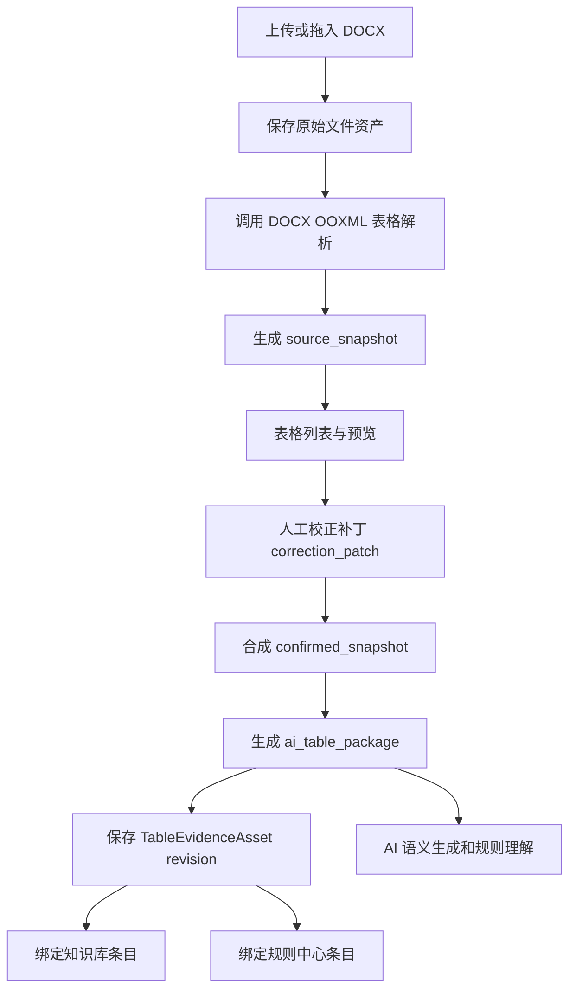

# 表格证据资产与保证级录入设计

## 背景

知识库和规则中心当前的表格录入使用同一套富内容编辑入口，但表格块本质仍是 `textarea` 加剪贴板解析。即使剪贴板包含 HTML，现有路径也只抽取粗粒度行列、合并单元格、边框轮廓、对齐轮廓和全表级字形信号，不能保留单元格级上标、下标、加粗、斜体、三线表、不可见字符和特殊符号。

用户真实目标不是让粘贴看起来更好，而是建立一条可审计、可人工修正、可被 AI 稳定读取的保证级表格证据录入链路。知识库和规则中心都需要这条能力，并且两边都应能创建、保存和绑定同一份表格证据。

## 已确认决策

- 保证级表格录入一期只承诺 `.docx` 文件上传或拖入后的解析、预览、校正和确认。
- 从 Word/WPS 中选中表格直接拖到网页、复制粘贴 HTML，只作为便捷采集或非保证级路径，不承诺完全保真。
- 知识库和规则中心都可以创建并保存表格证据。
- 表格证据是共享资产，可以同时绑定知识库条目、规则草稿、正式规则或后续其他治理对象。
- 采用 `TableEvidenceAsset` 方案：源快照不可变，人工校正以补丁方式保存，最终确认快照和 AI 表格包由源快照加补丁生成。
- 不考虑旧表格数据兼容。新表格录入统一以表格证据资产作为真源。
- 一期按完整校正范围设计：文字、字形、结构、边框、对齐、表题、表注、不可见字符、不可见格式和特殊符号。

## 目标

- 为知识库和规则中心提供统一的保证级 Word 表格证据录入能力。
- 从 `.docx` 原文件中解析表格，保留 OOXML 层面的结构、样式、特殊字符和不可见字符。
- 提供可视化预览和人工校正工作区，让用户在保存前看到系统识别结果并修正错误。
- 保存源解析结果、人工校正补丁、最终确认结果和 AI 可读表格包。
- 让 AI、知识库检索、规则中心执行都只使用最终确认表格包，不使用未确认源快照。
- 让已发布规则锁定表格证据 revision，避免后续修改静默改变已发布规则依据。

## 非目标

- 不承诺浏览器剪贴板或拖选文本路径达到完全保真。
- 不把截图 OCR 作为保证级表格证据来源。
- 不直接保存未经约束的 Word HTML 并让 AI 读取。
- 不让 AI 自动修复表格识别错误后直接作为权威证据。
- 不在本设计中解决完整 Word 在线编辑器能力；本设计只覆盖表格证据录入、校正、确认和下游使用。

## 核心概念

### TableEvidenceAsset

`TableEvidenceAsset` 是共享表格证据资产。它不属于知识库或规则中心某一方，而是被两边创建、保存、绑定和复用。

一个资产至少包含：

- 原始 DOCX 文件引用
- 解析器信息和版本
- 源快照 `source_snapshot`
- 人工校正补丁 `correction_patch`
- 最终确认快照 `confirmed_snapshot`
- AI 表格包 `ai_table_package`
- 保真状态 `fidelity_status`
- 绑定关系
- revision 历史

### 源快照

源快照是从 DOCX OOXML 自动解析出来的结果。它记录系统从原文件中识别到什么。源快照不可变，不能被人工编辑覆盖。

源快照用于：

- 追溯原始识别结果
- 对比人工校正差异
- 判断解析器能力缺口
- 复现证据链

### 人工校正补丁

人工校正补丁记录用户在预览区修改了什么。补丁不是简单覆盖源快照，而是可审计的语义操作集合。

补丁操作包括：

- 修改单元格文本或文本片段
- 修改文本片段样式
- 合并或拆分单元格
- 插入、删除、移动行列
- 修改边框、三线表、对齐、段落样式
- 修改表题、表注
- 标记不可见字符或特殊符号确认结果

### 最终确认快照

最终确认快照由源快照和人工校正补丁合成。用户确认后，它成为知识库、规则中心和 AI 使用的表格事实来源。

### AI 表格包

AI 表格包是从最终确认快照派生的结构化输入。AI 不直接读取截图、textarea、HTML 或未确认源快照。

AI 表格包必须保留：

- 表题、表号、表注
- 行列结构
- 合并单元格
- 表头层级
- 行头和列头关系
- 每个单元格坐标、角色和文本
- 文本片段 `runs`
- 上标、下标、加粗、斜体、字体、字号
- Unicode 码点
- 不可见字符标记
- 段落边界、Tab、换行
- 三线表、边框、对齐、段落样式摘要
- 人工确认标记

## 用户流程

### 从知识库录入

1. 用户进入知识库，点击“添加 Word 表格证据”。
2. 用户上传或拖入 `.docx` 文件。
3. 系统解析 DOCX 并列出文档中的表格。
4. 用户选择目标表格。
5. 用户在表格证据工作区预览识别结果。
6. 如果识别正确，用户直接确认。
7. 如果识别错误，用户在预览区校正文字、结构、格式、特殊字符和不可见字符。
8. 用户确认后生成 `TableEvidenceAsset` revision。
9. 系统将该 revision 绑定到当前知识条目或知识修订。

### 从规则中心录入

1. 用户进入规则中心或规则向导，点击“添加 Word 表格证据”。
2. 上传、解析、预览、校正和确认流程与知识库一致。
3. 确认后生成或复用 `TableEvidenceAsset` revision。
4. 系统将该 revision 绑定到规则草稿、正式规则或规则证据项。

### 复用已有证据

知识库和规则中心都应提供“选择已有表格证据”的入口。用户可以搜索已确认表格证据，并将同一个 revision 绑定到新的知识条目或规则条目。

## 数据流



## 数据模型

### TableEvidenceAsset

```ts
interface TableEvidenceAsset {
  id: string;
  title: string;
  source_file_asset_id: string;
  source_file_name: string;
  source_kind: "docx_upload";
  parser: "python_docx_ooxml";
  parser_version: string;
  active_revision_id: string;
  fidelity_status: "pending" | "confirmed" | "needs_review";
  created_by: string;
  created_at: string;
  updated_at: string;
}
```

### TableEvidenceRevision

```ts
interface TableEvidenceRevision {
  id: string;
  table_evidence_asset_id: string;
  revision_no: number;
  source_snapshot: TableSourceSnapshot;
  correction_patch: TableCorrectionPatch;
  confirmed_snapshot: ConfirmedTableSnapshot;
  ai_table_package: ConfirmedAiTablePackage;
  fidelity_report: TableFidelityReport;
  confirmation_status: "pending" | "confirmed" | "needs_review";
  confirmed_by?: string;
  confirmed_at?: string;
  created_at: string;
}
```

### TableEvidenceBinding

```ts
interface TableEvidenceBinding {
  id: string;
  table_evidence_asset_id: string;
  table_evidence_revision_id: string;
  target_type: "knowledge_revision" | "editorial_rule" | "rule_draft";
  target_id: string;
  binding_role:
    | "source_evidence"
    | "example"
    | "rule_basis"
    | "format_requirement";
  created_at: string;
}
```

### revision 规则

- 源快照不可变。
- 人工校正生成新 revision，不覆盖已确认 revision。
- 草稿可以绑定最新 revision。
- 已发布规则必须绑定具体 revision。
- 后续修正表格证据时，不应静默改变已发布规则。系统应提示用户是否创建规则修订或重新审核。

## DOCX 保证级解析

保证级路径只以 DOCX OOXML 为权威来源。解析器必须读取 `word/document.xml`，识别正文表格、表题、表注、行列、合并关系、边框、段落样式、run 样式、符号和对象。

现有 worker 已具备基础能力：

- 表格结构和语义快照
- `grid_cells`
- `merged_relations`
- 单元格段落
- inline fragments
- `bold`
- `italic`
- `script_position`
- `symbol_font`
- `symbol_char`
- tab 和换行 fragment
- 边框 hints

本设计要求在保证级路径中补强两点：

1. 不允许对权威字符字段做 `strip`、空白折叠或 Unicode 近似归一。
2. 必须以 fragment 文本作为字符真源，摘要文本只能派生，不能反向覆盖 fragment。

## 字符和不可见格式保真

### 必须区分的不可见字符

- 半角空格 `U+0020`
- 全角空格 `U+3000`
- 不间断空格 `U+00A0`
- Tab `U+0009`
- 换行 `U+000A`
- 段落边界
- 首尾空格
- 连续空格

### 必须区分的相似字符

- 连字符 `-` / `U+002D`
- en dash `–` / `U+2013`
- em dash `—` / `U+2014`
- minus sign `−` / `U+2212`
- 全角横线或其他 CJK 标点
- 上标负号 `⁻` / `U+207B`
- 上标数字如 `¹` / `U+00B9`

例如 Windows `Alt+0150` 通常生成 en dash `–` / `U+2013`。系统应保存实际 Unicode 字符和码点，不应把它改成普通连字符。

### 特殊符号

系统必须保留以下信息：

- 解码后的字符
- Unicode 码点
- OOXML 符号来源
- `w:sym` 的原始 `w:char`
- `w:sym` 的原始字体
- 片段样式

例如一个 Symbol 字体的 alpha 应保存：

```json
{
  "kind": "symbol",
  "text": "α",
  "codepoints": ["03B1"],
  "symbol_font": "Symbol",
  "symbol_char": "03B1"
}
```

## 表格证据工作区

### 表格列表

上传 DOCX 后，系统列出识别到的全部表格。列表项显示：

- 表格序号
- 表号和表题
- 行列数
- 是否含合并单元格
- 是否含特殊字符
- 是否含不可见字符
- 是否含对象、图片表格、嵌套表格或文本框表格
- 当前识别状态

### 主预览区

主预览区显示可编辑表格，不再使用 textarea。它支持：

- 合并单元格
- 三线表
- 边框
- 水平和垂直对齐
- 上标和下标
- 加粗和斜体
- 特殊符号
- 段落边界
- 不可见字符显示

### 视图模式

预览区提供三种视图：

- 源识别视图：只看 DOCX 自动解析结果。
- 校正后视图：看源快照加补丁后的结果。
- 差异视图：看用户修改了哪些单元格、字符、结构和样式。

### 单元格编辑

用户可以点击单元格编辑文本。文本编辑必须保留不可见字符。编辑器应提供“显示不可见字符”开关，并在开启后用可读标记显示：

- 半角空格：`·`
- 全角空格：`□`
- 不间断空格：`NBSP`
- Tab：`→`
- 换行：`↵`
- 段落边界：`¶`

这些标记仅用于显示，不写回真实文本。

### 字形编辑

用户可以选中文本片段并设置：

- 加粗
- 斜体
- 上标
- 下标
- 字体
- 字号

编辑结果以 fragment/run 级补丁保存。

### 结构编辑

用户可以：

- 合并单元格
- 拆分单元格
- 插入行列
- 删除行列
- 调整表头层级
- 标记行头和列头

结构修改必须同步更新坐标、合并关系和 AI 表格包。

### 格式编辑

用户可以编辑：

- 三线表
- 单元格边框
- 水平对齐
- 垂直对齐
- 段前段后
- 行距
- 缩进
- 文字方向

复杂格式放入属性面板，避免主表格区域过度复杂。

### 保真检查面板

右侧面板显示：

- 结构是否完整
- 合并单元格是否完整
- 边框系统是否完整
- 段落样式是否完整
- 字形信息是否完整
- 特殊字符是否已确认
- 不可见字符是否已确认
- 表题表注是否已确认

用户界面只暴露简单状态：

- 待确认
- 已确认
- 需复核

内部仍保留详细 failure code 和 authority group。

## AI 表格包

AI 表格包由最终确认快照派生。它必须是稳定、结构化、可审计的 JSON，而不是截图、HTML 或自然语言表格。

示例：

```json
{
  "table_id": "table-evidence-123:revision-2",
  "caption": "表 1 两组 Hcy 水平比较",
  "confirmed_by_human": true,
  "structure": {
    "row_count": 4,
    "column_count": 5,
    "header_depth": 2,
    "merged_cells": [
      { "row": 0, "column": 1, "rowspan": 1, "colspan": 2 }
    ]
  },
  "cells": [
    {
      "row": 0,
      "column": 2,
      "role": "header",
      "text": "Hcy（μmol·L⁻¹）",
      "codepoints": [
        "0048",
        "0063",
        "0079",
        "FF08",
        "03BC",
        "006D",
        "006F",
        "006C",
        "00B7",
        "004C",
        "207B",
        "00B9",
        "FF09"
      ],
      "runs": [
        { "text": "Hcy（μmol·L", "style": {} },
        {
          "text": "⁻¹",
          "style": { "superscript": true },
          "codepoints": ["207B", "00B9"]
        },
        { "text": "）", "style": {} }
      ]
    }
  ]
}
```

AI 调用提示必须包含以下约束：

- 以 `confirmed_table_package` 为准。
- 不要混同 `-`、`–`、`—`、`−`。
- 不要折叠全角、半角或不间断空格。
- 上标和下标优先读取 `runs.style`。
- 未确认或需复核的表格不得作为权威依据。

## 知识库和规则中心接入

### 知识库

知识条目或知识修订可以绑定一个或多个表格证据 revision。知识库语义生成应读取 `ai_table_package`，并在页面上显示“已确认表格证据”状态。

### 规则中心

规则草稿和正式规则可以绑定一个或多个表格证据 revision。规则中心规则生成、审核、发布和运行时解释都应读取 `ai_table_package`。

### 共享入口

两个模块使用同一套前端组件：

- `TableEvidenceUploadEntry`
- `TableEvidencePicker`
- `TableEvidenceWorkspace`
- `TableEvidenceRenderer`
- `InvisibleCharacterOverlay`
- `TableEvidenceFidelityPanel`

两个模块使用同一套后端服务：

- 上传并保存 DOCX 文件
- 调用 DOCX worker
- 创建源快照
- 保存校正补丁
- 合成确认快照
- 生成 AI 表格包
- 绑定目标对象

## 门禁和状态

### 保证级条件

只有满足以下条件的表格证据才能标记为保证级：

- 来源是 `.docx` 上传或拖入文件。
- 使用 OOXML 解析器。
- 源快照存在。
- 最终确认快照存在。
- AI 表格包存在。
- 用户已确认。
- 必要 fact group 没有 `unavailable` 或 `unsupported`。
- 不可见字符和特殊符号检查完成。

### 需复核条件

出现以下情况时进入需复核：

- DOCX 无法解析。
- 表格是图片、OCR 表格或无法结构化对象。
- 嵌套表格或文本框表格无法完整展开。
- 合并单元格关系不完整。
- 必要字符或样式无法确认。
- 用户保存了补丁但未确认。

### 发布约束

- 草稿可以绑定待确认表格证据，但必须显示风险。
- 正式发布规则不能把未确认表格作为权威依据。
- 已发布规则必须锁定具体表格证据 revision。
- 表格证据后续修订不能静默影响已发布规则。

## 错误处理

- 上传非 DOCX 文件：拒绝保证级路径，提示仅支持 `.docx`。
- DOCX 无 `word/document.xml`：进入需复核，保留文件资产。
- 解析器失败：显示失败原因，允许重新解析或人工重新上传。
- 未识别到表格：提示没有可录入表格。
- 表格含图片或 OCR 表格：标记需复核，不作为保证级。
- 用户取消确认：保留草稿补丁，不生成权威 revision。
- 绑定目标不存在：保存表格资产失败或拒绝绑定，不丢失已确认表格 revision。

## 验收标准

### DOCX 表格识别

- 上传含三线表的 DOCX，预览显示顶线、表头线、底线和无竖线状态。
- 上传含合并单元格的 DOCX，预览显示正确 rowspan 和 colspan。
- 上传含表题、表注的 DOCX，系统识别并允许用户确认或修改。

### 字形和特殊字符

- 上标、下标、加粗、斜体能在预览区显示、修改、保存，并进入 AI 表格包。
- `-`、`–`、`—`、`−` 必须在保存和 AI 表格包中保持不同码点。
- Windows `Alt+0150` 产生的 `–` 必须保存为 `U+2013`。
- `<w:sym>` 符号必须保存解码字符、原始字体和原始 `w:char`。

### 不可见字符和不可见格式

- 半角空格、全角空格、不间断空格、连续空格、首尾空格、Tab、换行和段落边界可以显示、编辑、保存。
- 显示不可见字符时，标记不污染真实文本。
- AI 表格包保留真实字符和码点。

### 人工校正

- 修改单元格文字后，源快照不变，补丁记录修改，确认快照反映修改。
- 修改结构后，坐标、合并关系和 AI 表格包同步更新。
- 修改边框或三线表后，预览和确认快照同步更新。

### 双端保存和复用

- 知识库可以创建、保存和绑定表格证据。
- 规则中心可以创建、保存和绑定表格证据。
- 同一表格证据 revision 可以同时绑定知识库和规则中心。
- 已发布规则锁定 revision，不受后续表格资产修订静默影响。

### AI 使用

- AI 只读取 `ai_table_package`。
- 未确认或需复核表格不会作为权威依据进入 AI 请求。
- AI 请求中包含字符码点和 run 样式，避免混淆相似符号和上下标。

## 实施阶段

### 阶段 1：共享表格证据后端

- 新增 `TableEvidenceAsset`、`TableEvidenceRevision`、`TableEvidenceBinding`。
- 增加 DOCX 上传到表格证据解析入口。
- 复用现有 DOCX worker 生成源快照。
- 增加 confirmed snapshot 和 AI table package 生成逻辑。
- 增加知识库和规则中心绑定接口。

### 阶段 2：worker 保真补强

- 移除保证级字段上的空白折叠和首尾裁剪。
- 以 fragment text 作为字符真源。
- 增加特殊符号、Alt 码字符、不可见字符、段落边界测试。
- 增加 `<w:sym>` 原始信息保留测试。

### 阶段 3：共享前端表格证据工作区

- 新增上传入口。
- 新增表格列表。
- 新增预览、校正和差异视图。
- 新增不可见字符显示。
- 新增保真检查面板。
- 新增确认保存和绑定流程。

### 阶段 4：AI 和发布门禁接入

- 知识库语义生成改读 AI 表格包。
- 规则中心规则生成和审核改读 AI 表格包。
- 发布门禁拒绝未确认表格作为权威依据。
- 已发布规则锁定表格证据 revision。

## 设计边界

当前路径是完整且必要的。更短的 textarea 或 HTML 存储方案无法满足保证级表格证据目标，因为它们不能稳定保留字符、结构、样式、校正历史和 AI 输入真源。

